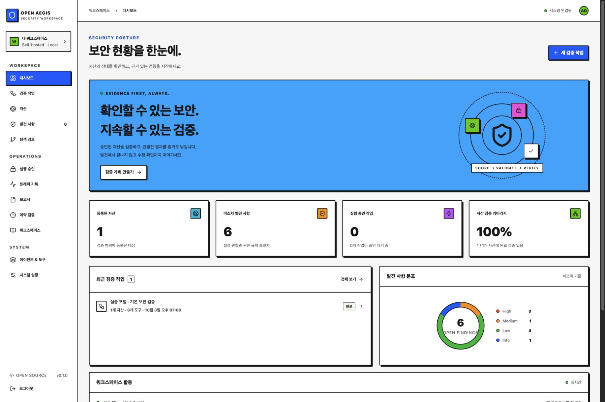

# Open Aegis

[English](README.en.md)

**자산부터 증거, 수정 확인까지 연결하는 오픈소스 보안 검증 워크스페이스.**

React + TypeScript 콘솔, Python/FastAPI 실행 엔진, SQLite 저장소로 구성됩니다.
상용 기능 구분 없이 저장소의 전체 구현을 MIT 라이선스로 제공합니다.



이 저장소는 ARTEX의 공개 기능 구성을 참고하여 독립적으로 작성했습니다.
ARTEX 코드를 복사하거나 포크하지 않았습니다. 현재 버전은 **0.2.0a1 로컬 검증 후보**이며
ARTEX 전체 기능과 동등하거나 모든 취약점을 검출한다고 주장하지 않습니다.
작업 템플릿의 버전·보관·현재 범위 적용은 [사용 계약](docs/TASK-TEMPLATES.md)에 있습니다.
구현된 기능과 차이는 [기능 비교표](docs/FEATURES.md)를 확인하세요.
원본의 기준 버전·기능 구조와 남은 연동의 완료 조건은 [ARTEX 검토](docs/ARTEX-REVIEW.md)에 있습니다.
최신 고정 소스의 공개 인터페이스와 추가 기능은 [전체 기능 추적 목록](docs/ARTEX-INVENTORY.md)에서 확인할 수 있습니다.

## 지금 사용할 수 있는 기능

- 한국어 반응형 콘솔: 대시보드, 작업, 자산, 관찰 링크, 발견 사항, 탐색 경로, 승인,
  트래픽, 보고서, 예약, 노트, 에이전트, 시스템 설정.
- 자산·담당자·태그·API 권한 규칙 등록 및 JSON 일괄 가져오기.
- ScopeSentry asset 파일/등록 원격 JWT 조회 검토·선택 반영·출처/이전 연결 조회([연동 계약](docs/SCOPESENTRY.md)).
- 범위 스냅샷을 갖는 작업, 실행 승인, 거절, 중지, 재시작 중단 처리 및 현재 범위의 새 승인 계획.
- 내장 도구 계약·코드 지문 승인 검사, 결과 형식·크기·관찰 범위 검증([도구 계약](docs/TOOL-CONTRACTS.md)).
- 규칙 기반 Planner, 선택적 OpenAI 호환 LLM 순서 계획, 최대 4개 Worker.
- 검토된 MCP GET 서버 선택·별도 작업 승인·서명 범위·결과/감사 원자적 저장([실행 설정](docs/MCP-EXECUTION.md)).
- 자연어 목표 분해 초안·검토/새 승인·과제별 자산/검사 조합 실행·검사 진행률([목표 계획](docs/GOAL-PLANNING.md)).
- HTTP 보안 헤더, HTTPS/HSTS/인증서 만료, 쿠키 속성, CORS 설정 관찰.
- 페이지 내 범위에 속한 링크 수집. 발견한 링크로 자동 요청하지 않습니다.
- 명시적으로 정의한 GET API 접근 규칙 검증. 인증 값은 서버 환경변수에 둡니다.
- 요청 메타데이터, 제한된 본문 해시, 증거, 커버리지, 실시간 활동 기록.
- 발견 사항 중복 통합, 상태 관리, 독립 재검증 및 증거 이력 보존.
- Markdown/CSV 보고서 및 JSON 증거 묶음 내보내기.
- 승인 대기 작업을 생성하는 주기적 예약, 운영 노트, 기록 기반 대화.
- 기존 자산·작업·발견 사항을 조회하는 읽기 전용 MCP stdio 서버.
- 관리자·운영자·조회자 계정, 암호 해시, 서버 세션, 출처/Host 검사, 로그인 시도 제한.

## 빠른 시작

Python 3.11+와 Node.js 22, npm이 필요합니다.

```sh
./start.sh
```

기본 주소는 **http://127.0.0.1:8787**입니다. 처음 열면 12자 이상의 관리자
비밀번호를 설정합니다. 기본 비밀번호는 없습니다.
`start.sh`는 가상환경에 잠긴 의존성을 설치하고 콘솔을 빌드한 뒤 실행합니다.
이미 사용 중인 포트라면 다음처럼 바꾸세요.

```sh
AEGIS_PORT=8790 ./start.sh
```

설정 파일을 사용하려면 `.env.example`을 `.env`로 복사해 수정합니다.
실행 환경변수는 `.env`보다 우선합니다. `.env`는 셸 코드로 실행하지 않습니다.

### Docker

```sh
cp .env.example .env
```

`.env`의 `AEGIS_SETUP_TOKEN`을 충분히 긴 무작위 값으로 설정한 다음 실행합니다.
토큰은 최초 관리자 설정에만 사용됩니다. 예를 들어 Python의
`secrets.token_urlsafe(32)`로 생성할 수 있습니다.

```sh
docker compose up --build -d
```

http://127.0.0.1:8787 에 접속하고 관리자 비밀번호 및 설치 토큰을 입력합니다.
컨테이너는 비관리자 사용자로 실행되며 데이터는 `aegis-data` 볼륨에 보존됩니다.
기본 포트 공개 범위는 호스트의 loopback입니다. 기본/드라이버 포함 이미지와 SQLite/PostgreSQL Compose를 GitHub의 Ubuntu24.04에서
검증했습니다. 시작·인증·볼륨 보존·백업 복구·정상 종료를 확인했으며
전체 운영/PITR·멀티 아키텍처 검수는 계속 진행 중입니다.
PostgreSQL 사용 시 `AEGIS_INSTALL_POSTGRES=1`로 재빌드하고 저장소 DSN·스키마를
설정합니다. DB/스키마 준비는 [설치 계약](docs/POSTGRES-STORAGE.md)을 따릅니다.
컨테이너 검수 절차와 확인 한계는 [운영 문서](docs/OPERATIONS.md)를 참고하세요.

설치 패키지에는 `aegis-backup`, `aegis-restore`, `aegis-verify-audit` 유지보수
명령이 포함됩니다. `aegis-checkpoint`로 최신 보관 기준과 비교한 체크포인트를
덮어쓰기 없이 추가할 수 있습니다([주기 보관](docs/AUDIT.md)). PostgreSQL 새 설치는 `aegis-init-postgres`로 SQLite 없이
시작할 수 있습니다. [저장소 설치](docs/POSTGRES-STORAGE.md)와
[백업·복구 운영 절차](docs/OPERATIONS.md)를 따르세요.

## 첫 검증

1. **자산**에서 검증 권한이 있는 URL을 등록합니다. scheme·hostname·port·경로가
   정확한 범위가 됩니다. `/app/` 등록은 `/app/*`만 허용합니다.
2. **검증 작업**에서 자산, 도구, Worker, Planner를 선택합니다.
3. **실행 승인**에서 실제 주소와 도구를 확인하고 승인합니다.
4. **발견 사항**에서 관찰 증거, 판정 유형, 수정 가이드를 확인합니다.
5. 수정 후 **재검증 계획**을 생성하고 승인합니다.
6. **보고서**에서 Markdown·CSV·JSON을 내보냅니다.

일반 대기 계획이나 종료 작업의 상세에서 **목표를 검증 과제로 나누기**로 새 초안을
준비할 수 있습니다. 규칙 모드는 등록 도구의 목록, AI 모드는 설정된 제공자의 자연어
분해입니다. 과제별 자산·도구·필요한 입력·의존 관계를 검토해 반영한 뒤 별도로
실행 승인합니다. 새 계획은 과제에서 요청한 조합만 실행하며 검사 완료가 목표
달성을 보장하지는 않습니다. 과제별 진행률의 **근거·재검증 확인**에서 원본 증거가
일치하는 발견과 별도 재검증 작업을 열 수 있습니다.

종료·할 일·자산 변경 이벤트에서 후속 제안을 자동으로 준비합니다. 작업 상세에서
준비 상태와 제안 근거를 검토해 새 승인 대기 계획으로 반영하며 실행은 별도 승인합니다.
재시작 처리 위치와 보장 범위는 [이벤트 Planner](docs/EVENT-PLANNER.md)에 정리했습니다.

HTTP에서 HTTPS로의 리다이렉트도 origin 변경입니다. 실제 서비스가 HTTPS라면
최종 HTTPS 주소를 등록하세요. 범위 밖 리다이렉트는 수행하지 않습니다.

### 로컬 실습

별도 터미널에서 합성 데이터만 제공하는 실습 서버를 실행합니다.

```sh
.venv/bin/python examples/lab_server.py
```

콘솔을 실습 모드로 실행하고 `http://127.0.0.1:9090/`를 자산으로 등록합니다.

```sh
AEGIS_LAB_MODE=1 AEGIS_PORT=8790 .venv/bin/python -m aegis
```

실습 모드는 사설·loopback 대상 연결을 허용합니다. 인터넷 서비스 운영 시에는
끄세요. 실습 서버를 중지한 뒤 다음 명령으로 방어 설정을 적용해 다시 실행하면
보안 헤더·쿠키·CORS 및 권한 규칙의 수정 전후를 비교할 수 있습니다.

```sh
AEGIS_LAB_HARDENED=1 .venv/bin/python examples/lab_server.py
```

이 실습 서버는 HTTP이므로 ‘암호화되지 않은 HTTP 연결’ 관찰은 계속 남습니다.

### API 권한 규칙

자산 등록의 ‘API 권한 규칙 설정’에서 규칙을 추가하고 경로·역할·예상 접근 결과를
입력합니다. 응답 스키마·소유권 검사는 선택 사항입니다. ‘JSON 편집’에서는 다음
형식의 배열을 직접 입력할 수도 있습니다.

```json
[
  {"path":"/api/account","role":"anonymous","expected_allowed":false,"credential_env":""},
  {"path":"/api/account","role":"test-user","expected_allowed":true,"credential_env":"AEGIS_TEST_USER"}
]
```

서버에 `AEGIS_TEST_USER`를 전체 Authorization 헤더 값으로 설정하세요.
실습 서버용 값은 `Bearer lab-test-token`입니다. 실제 인증정보는 Git·URL·노트에
입력하지 않습니다. Compose 기본 구성은 `AEGIS_TEST_USER`를 전달하며 추가 계정은
Compose의 환경변수 전달 항목을 추가해야 합니다.

기본 판정은 2xx 허용, 401/403 거절과 운영자가 정의한 기대값을 비교합니다.
선택적인 `response_schema`와 `ownership`으로 JSON 응답 구조와 고객사·리소스
소유권 필드도 검사할 수 있습니다. [API 정책 형식·판정 기준](docs/API-POLICY.md)을
참고하세요. 응답 원문과 실제 소유권 값은 저장하지 않으며, 본문 계약 설정 시
로그인 HTML·잘린 응답·잘못된 JSON은 판정 불가로 처리합니다. 독립적인 고객사
소유권 추론이나 로그인 자동화는 제공하지 않습니다.

승인된 작업은 `/api/tasks/<task_id>/policy-reproduction`에서 규칙을 내려받아
`aegis-replay-policy --source aegis-api-policy.json`으로 검사할 수 있습니다.
실제 GET 재현은 현재 권한을 확인하고 `--run`을 명시해야 합니다. 인증 값은 파일에
포함되지 않습니다. 세부 실행·종료 코드와 한계는 위 API 정책 문서에 정리했습니다.

### 선택적 AI Planner

```text
AEGIS_LLM_API_KEY=<provider key>
AEGIS_LLM_MODEL=<model name>
AEGIS_LLM_BASE_URL=https://your-provider.example/v1
AEGIS_LLM_CHAT_ENABLED=0
```

서버를 재시작하고 작업에서 AI Planner를 선택합니다. 승인된 도구의 실행 순서만
제안하며 도구 추가·범위 확대·임의 명령 실행을 할 수 없습니다. 연결 실패나
유효하지 않은 응답은 활동 기록에 남기고 규칙 기반 계획으로 전환합니다.
상용 LLM 실호출은 키가 없어 검증하지 않았습니다. 실패 전환과 결과 검증은
자동 테스트에 포함됩니다.
제공자가 보고한 입력·출력·합계 토큰은 작업 상세와 JSON/Markdown 보고서에서
확인합니다. 누락·잘못된 값은 0이나 비용으로 추정하지 않습니다. [사용량 계약](docs/LLM-USAGE.md)을 참고하세요.

`AEGIS_LLM_PRICES`에 모델/제공자별 단가·통화·출처·기준일을 설정하면 호출 당시
가격으로 토큰 비용을 추정하고 통화별 부분 합계를 표시합니다. 가격이 없는 기록은
미확인이며 캐시·추가 요금이나 실제 청구를 검증하지 않습니다. [가격 설정과 비용 계약](docs/LLM-COSTS.md)을 참고하세요.

시스템 설정에서 저장된 계획·답변과 별도 호출 시도 기록을 구분해 집계합니다.
답변 저장 실패·세션 만료·재시작 중단도 기록하며, 미확인 사용량을 0으로 처리하지 않습니다.
개별 호출 이력에서 저장 상태·모델·작업으로 검색하고 사용량·가격 근거와 연결된 작업을 확인합니다.
[호출 기록과 복구 계약](docs/LLM-CALLS.md)을 참고하세요.

AI 대화 초안을 사용하려면 `AEGIS_LLM_CHAT_ENABLED=1`로 설정하고 작업 대화의
답변 방식에서 AI를 선택하세요. 질문과 저장된 기록·관찰 발췌가 제공자에게 전달됩니다.
출처 번호/형식을 검사하며, 오류 시 규칙 요약으로 복구합니다. 내용의 사실성은
직접 검토해야 합니다. [대화·출처 계약](docs/CONVERSATION.md)을 확인하세요.

릴리스의 wheel·화면·잠금 파일을 별도 신뢰 공개 키로 검증하고, 서버 종료 후
업데이트 전 백업을 준비하는 `aegis-release` CLI가 있습니다.
[서명·사전 점검·복구 절차](docs/RELEASES.md)를 따르세요. 이 도구는 자동 설치나
서비스 전환을 수행하지 않습니다.
시스템 설정에서 전체·최근 7일·최근 30일의 작업별 마지막 계획 호출과 검증된 토큰
합계를 조회할 수 있습니다. 여러 회차의 호출 이력이나 청구 비용을 합산하는 기능은 아닙니다.

### MCP 연결

MCP 2025-03-26 stdio 방식입니다. 클라이언트가 다음 프로세스를 실행하도록 설정합니다.

```json
{
  "mcpServers": {
    "open-aegis": {
      "command": "/absolute/path/to/repo/.venv/bin/python",
      "args": ["-m", "aegis.mcp"],
      "env": {"AEGIS_DATA_DIR": "/absolute/path/to/repo/data"}
    }
  }
}
```

목록·상세 도구는 `list_assets`, `list_findings`, `get_task`, `get_finding`이며,
증거·재검증·이벤트는 별도 페이지 도구로 순회합니다. 목록 응답은 `items`와
전체 건수·페이지 메타데이터를 갖는 객체입니다. [MCP 조회 계약](docs/MCP.md)에
인수, 기존 배열 응답의 변경 사항과 제한을 정리했습니다.
기본 SQLite 또는 명시적으로 선택한 PostgreSQL을 읽기 전용 snapshot으로 열며 인증 설정, 명령 실행, 승인 기능은
노출하지 않습니다. 조회 결과가 MCP 클라이언트와 연결된 모델에 전달될 수 있습니다.
별도 [원격 Streamable HTTP 클라이언트 기반](docs/REMOTE-MCP.md)은 초기화·도구 목록·
정확한 입력의 명시적 일회용 호출과 JSON/SSE·DNS/TLS 검증을 지원합니다. 시스템 설정에서
관리자 목록 검토·메타데이터 등록·비활성화와 해당 감사 저장을 지원하며, 앱의 외부
도구 실행 승인·스코프 강제·격리된 실행은 아직 연결 전입니다.
별도 [서명된 범위의 MCP 실행 서버](docs/MCP-EXECUTION.md)는 승인 스냅샷에서 발급한
일회용 권한으로 내장 GET 검사 6개를 실행하고 결과 계약을 검증하는 기반입니다.
메인 승인·Worker·저장 연결과 일반 플러그인 격리는 아직 남아 있습니다.

## 검증 및 운영

```sh
.venv/bin/pip install -r requirements-dev.lock
.venv/bin/python -m pytest -q
cd web
npm ci
npm test
npm run build
```

테스트는 합성 loopback 서버만 사용합니다. 승인 전 무요청, 범위/주소 차단,
DNS pinning, 비밀정보 비저장, 수정 전후 재검증, 오류 시 판정 불가, MCP 읽기
전용 조회를 검증합니다. 자동 테스트와 프런트엔드 빌드 결과는
[검증 기록](docs/VALIDATION.md)에 남겼습니다.
합성 목록·요약·보고서 부하의 RSS/CPU와 입장 제한·정상 종료를 별도 서버에서
측정하는 명령은 [로컬 부하 리허설](docs/RESOURCE-LOAD.md)에 있습니다.

기본 SQLite의 데이터 백업은 서버 실행 중에도 일관된 백업 API로 수행합니다.
PostgreSQL 선택 시에는 [온라인 논리 백업·새 스키마 복구](docs/POSTGRES-STORAGE.md)를
사용합니다. 백업·복구 CLI도 `AEGIS_STORAGE_BACKEND` 또는 `--backend`를 따릅니다.

```sh
.venv/bin/python scripts/backup.py --backend sqlite --output backups/aegis-backup.db
```

백업에는 사용자 암호 해시와 세션 해시가 포함됩니다. 접근을 제한하세요.
복구는 서버를 종료한 뒤 검증·복구 명령으로 진행합니다. 기존 DB는 자동으로
별도 보존하고, 복구한 세션은 모두 무효화합니다.

```sh
.venv/bin/python scripts/restore.py --backend sqlite --source backups/aegis-backup.db --check-only
.venv/bin/python scripts/restore.py --backend sqlite --source backups/aegis-backup.db --destination data/aegis.db
```

서버와 복구 도구는 같은 디렉터리의 파일 잠금을 사용합니다. 서버가 실행 중이면
복구와 두 번째 서버 시작을 거절합니다. `.server.lock` 파일의 존재 자체는 실행 상태가
아닙니다. 서버가 종료되거나 프로세스가 죽으면 OS가 잠금을 해제합니다.
Linux/macOS에서 실행하며 Windows는 WSL 또는 컨테이너를 사용하세요.
[운영·복구 안내](docs/OPERATIONS.md)를 참고하세요.

현재 단일 워크스페이스·단일 프로세스 구성이며 기본 저장소는 SQLite입니다. 역할별 권한은 지원하지만
고객사별 데이터 격리와 여러 서버 인스턴스는 아직 지원하지 않습니다. PostgreSQL HTTP 선택 실행은
구현했으며 운영 복구·업그레이드·전체 부하 검수는 진행 중입니다.
외부 보안 감사도 수행되지 않았습니다.
[보안 정책](SECURITY.md), [위협 모델](docs/THREAT-MODEL.md), [아키텍처](docs/ARCHITECTURE.md),
[기여 가이드](CONTRIBUTING.md)를 참고하세요.

## 계정과 권한

최초 설정에서는 사용자 이름(기본 `admin`)과 비밀번호를 지정합니다.
관리자는 사용자 관리 화면에서 계정을 추가·수정·비활성화하고 비밀번호를 재설정합니다.
운영자는 자산·계획·조치와 작업 중지를 관리하고, 실행 승인은 관리자가 진행합니다.
조회자는 기록·증거 조회와 보고서 내보내기를 할 수 있습니다.
모든 사용자는 같은 워크스페이스의 기록을 공유합니다.

기존 0.1 DB는 자동 백업 후 이전됩니다. 기존 관리자는 `admin` 사용자 이름으로
기존 비밀번호를 사용하며, 이전 세션은 만료됩니다. 권한·계정 상태·비밀번호를
변경하면 해당 사용자의 모든 기존 세션이 만료됩니다.

## v1 개발 현황과 디자인

[v1 출시 기준](docs/V1-READINESS.md)으로 미완료 항목을 추적합니다.
컬러 출처와 의미별 값, Neo-brutalism 적용 규칙은 [디자인 문서](docs/DESIGN.md)에 정리했습니다.
자산은 수정·보관·복원이 가능하며, 수정 전 계획의 승인은 무효화됩니다.
보관 시 예약을 중지하고 기존 증거를 유지합니다.

## 라이선스

[MIT](LICENSE). 유료 기능이나 라이선스 키는 없습니다.

### 실행 제한과 재실행

origin별 요청 속도·동시 수, DNS/HTTP/작업/대기열 시간 제한, 재시도 예산을
`.env.example`에서 설정할 수 있습니다. 변경 후 새 계획으로 범위와 정책을
승인하세요. 실패·중단·중지 작업의 재실행은 원본을 보존하는 새 승인 계획입니다.
시스템 설정에서 대기열·요청·시간 초과 지표를 확인할 수 있습니다.
기본값과 허용 범위, 중지·종료의 보장 한계는 [운영 정책](docs/RUNTIME.md)에 있습니다.


보고서 다운로드는 기본 동시 2개·120초로 제한합니다. `.env`의
`AEGIS_EXPORT_PARALLEL`(1–4), `AEGIS_EXPORT_TIMEOUT`(1–600초)으로 조정하고 서버를
재시작하세요. 한도가 찼을 때는 429와 Retry-After: 5를 반환합니다. 시스템 설정에서
진행·완료·거절·시간 초과 지표를 확인할 수 있습니다. 스트리밍 계약과 한계는
[보고서 문서](docs/REPORTS.md)에 정리했습니다.

PostgreSQL 첫 설치는 `aegis-init-postgres`로 빈 네이티브 스키마를 준비합니다.
SQLite와 새 PostgreSQL 스키마 사이의 검증된 오프라인 데이터 전송은
`aegis-transfer-storage`로 수행합니다. 기본 HTTP 서비스는 SQLite이며,
`AEGIS_STORAGE_BACKEND=postgres`와 DSN/schema 설정으로 준비된 PostgreSQL 저장소를 선택합니다.
네이티브 HTTP 인증·승인 실행·보고서·가져오기·정상 재시작과 실행 소유권/연결 상실 차단을 검수했습니다.
전체 운영 복구·스키마 업그레이드·장시간 부하 검수는 진행 중입니다.
[저장소·전송 계약](docs/POSTGRES-STORAGE.md)을 확인하세요.

작업 분류의 조직·일괄 변경 범위는 [계약](docs/TASK-CATEGORIES.md)을 참고하세요.

종료 작업의 보관·복원 범위는 [사용 계약](docs/TASK-ARCHIVES.md)을 참고하세요.

작업 종료 webhook의 관리자 설정·테스트·수동 재전송 범위는 [알림 계약](docs/NOTIFICATIONS.md)을 참고하세요.

계획/기록 대화의 추가 지침과 호출 당시 버전은 [프롬프트 계약](docs/PROMPT-VERSIONS.md)을 참고하세요.
