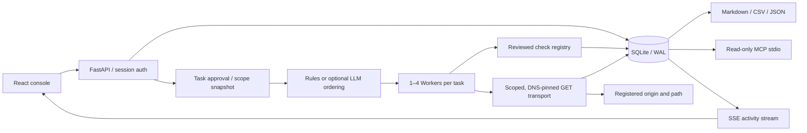

# Architecture

`aegis/app.py` owns API validation, authentication, scheduling, report exports,
and the process lifecycle. `aegis/store.py` owns persistence. `aegis/engine.py`
owns task state transitions and parallel execution. `aegis/network.py` is the
only transport for target HTTP requests. `aegis/checks.py` defines observations
and expected policy comparisons. `aegis/mcp.py` opens an existing DB read-only.

`aegis/response_policy.py` validates a bounded JSON Schema subset and JSON Pointer
ownership expectations on complete JSON responses. It rejects remote references,
ambiguous/truncated bodies and excessive structure. Findings retain schema keyword
names or match booleans, never response values. See [API-POLICY.md](API-POLICY.md).

`aegis/scopesentry.py` independently parses reviewed asset NDJSON exports, stores bounded
actor-bound preview records, and explicitly applies selected assets/source links. Source
IDs and URL changes retain separate connection history without altering task snapshots.
Its business writes and the import audit event share one SQLite write transaction; the
HTTP request audit remains separate. `scopesentry_remote.py` adds configured JWT read
requests with pinned DNS/TLS, bounded pages, previous-boundary checks and atomic cached
next-preview pointers. Source positional pagination is not a coherent snapshot. No automatic
execution is performed. See [SCOPESENTRY.md](SCOPESENTRY.md).

## Task states

`pending → queued → running → completed/failed/stopped`.
Pending rejection becomes `rejected`. Mid-run stop becomes `stopping` until
in-flight bounded socket operations finish. On restart, queued/running tasks
become `interrupted`; they are not automatically resumed. Scope snapshots
preserve the exact assets and policy rules approved for that task.

An LLM can reorder the selected checks only. Its result must be an exact
permutation of approved check IDs. Provider errors and invalid plans fall
back to the deterministic order and are visible in the activity log.

`aegis/tool_contracts.py` snapshots built-in check contracts and a process-start Python
source compatibility fingerprint into new plans. Approval, execution and Worker admission
compare it before target requests. Complete check results pass shape/size/count/scope
validation before any finding is written. This is not an external plugin loader, code
signature or process sandbox; see [TOOL-CONTRACTS.md](TOOL-CONTRACTS.md).

## Evidence and conclusions

A finding fingerprint is derived from asset ID, check ID, and observation
code. Evidence records are appended to the finding rather than replaced.
Retest resolves the original finding only when the relevant check completed
and no longer reported that fingerprint. A failed connection, skipped check,
server error, or cancellation produces an inconclusive retest.

Target bodies are held transiently (max 128 KiB for checks), never persisted.
Traffic stores a bounded-body hash and allowlisted response headers. Cookies,
Authorization, query values, and response bodies are excluded. User-entered
metadata is not automatically a safe place for secrets.

The UI uses server data rather than seeded production findings. Its relationship graph
links actual assets, task scope, checks, findings, evidence and observed links, with
selection and paginated detail views. It is not a complete attack graph; see [GRAPH.md](GRAPH.md).

## Operational limits

One server process, shared workspace with admin/operator/viewer roles, SQLite WAL; no distributed scheduling or tenant isolation.
Default task concurrency is 2, workers per task at most 4, target requests per
asset 24 and HTTP timeout 8 seconds. Runtime policy controls the configurable
limits; see [RUNTIME.md](RUNTIME.md). Stop is cooperative, not a forced
thread interruption. Records require an operator-controlled backup
and retention policy. Existing report exports include finding lifecycle state
as of export time, not an immutable historical status snapshot.

Schema version 1 adds users and user-bound sessions. Legacy administrator
credentials move transactionally to the admin account after an automatic backup;
legacy sessions are revoked. Server and restore share an OS workspace lease.
Offline restore normalizes the staging DB to DELETE journal mode before replacing
the database, so session deletion cannot remain only in an uninstalled WAL file.

Schema version 2 adds atomic event hash links and local chain state. Read-only CLI
and administrator UI verify complete snapshots and optionally compare a previously
retained checkpoint. They do not authenticate all business data or guarantee its
changes and audit events share a transaction. External checkpoint automation remains
unimplemented. See [AUDIT.md](AUDIT.md) and the [threat model](THREAT-MODEL.md).
