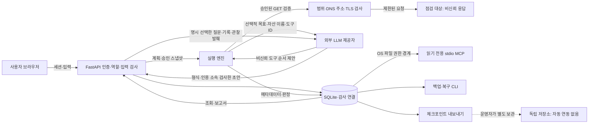

# Open Aegis 위협 모델

대상은 현재 0.1.0 구현의 단일 프로세스·SQLite·공유 워크스페이스다. 이 문서는
설계 의도와 실제 보호 조치를 구분하고 v1에 필요한 남은 검증을 기록한다.
외부 보안 감사, 침투 테스트 인증 또는 서비스 전체의 안전성을 증명하는 문서가 아니다.
코드와 검증 기록이 바뀌면 해당 경계와 위협 항목도 함께 갱신한다.

## 보호할 자산과 운영 전제

- 관리자·운영자·조회자의 계정, 세션, 승인 권한.
- 등록 자산의 정확한 origin·경로, revision, 승인된 도구·실행 제한.
- 발견·증거·재검증·조치 이력, 작업 대화·노트·보고서.
- 서버 환경변수의 테스트 계정 인증 값과 LLM 제공자 키.
- SQLite 원본·WAL·백업과 독립 보관 체크포인트.
- 점검 대상의 가용성, 서비스의 CPU·메모리·연결·디스크 자원.

운영자는 점검 권한과 테스트 계정을 확보하고 등록 범위 및 승인 정책을 검토한다.
등록 체크박스나 승인 기록 자체는 외부 대상에 대한 법적 권한의 증명이 아니다.
기본 운영 경계는 loopback 또는 별도 인증을 갖춘 사설 네트워크이며, 원격 접근은
운영자가 HTTPS·Secure 쿠키·프록시 신뢰·접근 제한을 구성해야 한다.
서버 OS 계정, 설치 파일과 환경 설정을 제어하는 운영 주체는 신뢰한다.
그 주체의 탈취까지 애플리케이션 내부 RBAC만으로 방어한다고 가정하지 않는다.

## 데이터 흐름과 신뢰 경계

관리자 원격 MCP 메타데이터 등록에는 별도 고정 endpoint·비신뢰 목록 경계가 있다.
[REMOTE-MCP.md](REMOTE-MCP.md)의 관리자 역할·만든 관리자만 반영·전체 목록 재조회·
등록 revision 비교·동일 트랜잭션 감사 저장을 적용한다. 목록 파싱은 최소 환경을
전달한 POSIX 자식 프로세스에서 수행하며 deadline·CPU·출력 한도를 설정한다.
이것은 조회 자원 경계이고 임의 코드·원격 서버의 파일시스템/egress sandbox가 아니다.
현재 등록은 실행 권한을 부여하거나 Planner·Worker·커버리지를 변경하지 않는다.
메타데이터 지문은 원격 구현과 실제 부작용을 증명하지 않는다. 원격 설명/스키마의
미확인 민감정보 식별과 실행 통합·대상 스코프 강제는 남아 있다.
별도 [MCP GET 실행 서버](MCP-EXECUTION.md)는 신뢰한 발급자의 승인 스냅샷 권한을
검사하고 대상 요청 전에 소비한다. 서버 측 GET·스코프·DNS/TLS·요청 제한과 전체
결과 계약을 적용한다. 메인 앱 연결·즉시 원격 취소·일반 플러그인 OS 격리는 미완료이며
서명과 코드 지문은 원격 런타임 또는 증거 진위의 attestation이 아니다.

| 경계 | 신뢰와 데이터 처리 |
|---|---|
| 브라우저 → API | 인증된 입력도 비신뢰다. 서버에서 모델·역할·출처/Host·범위를 검사한다. UI의 숨김·비활성 상태를 권한 경계로 사용하지 않는다. |
| 승인 → 실행 | 현재 자산 revision과 스냅샷·도구·제한을 확인한다. 예약은 승인 대기 계획만 만든다. |
| 전송 → 점검 대상 | DNS·리다이렉트·응답은 비신뢰다. 검증된 주소에 연결하고 GET 범위와 TLS 호스트 검사를 적용한다. |
| 엔진 → LLM | 제공자는 선택된 목표·자산 이름/타입·도구 ID를 받는 외부 수신자다. 응답은 승인 도구의 정확한 순열만 허용한다. |
| 명시 선택한 대화 → LLM | 서버 기능 활성화와 운영자의 AI 초안 선택 시 질문·기록·관찰 발췌를 제공자로 보낸다. 인용은 현재 기록의 번호만 허용하고 형식 오류는 규칙 요약으로 복구한다. 답변 내용의 사실성과 악성 텍스트의 의미적 차단은 보장하지 않으며 도구나 명령을 실행하지 않는다. [대화 계약](CONVERSATION.md) |
| API → SQLite | 저장 데이터가 항상 올바르다고 가정하지 않는다. 연결 검증은 감사 이벤트에만 적용하며 모든 업무 데이터의 무결성을 인증하지 않는다. |
| SQLite → MCP/CLI | HTTP 세션·RBAC와 별도의 OS 파일 접근 경계다. 해당 파일을 읽을 수 있는 MCP 프로세스는 워크스페이스 기록을 조회할 수 있다. |
| 내보내기 → 수신자 | 보고서·백업·MCP 결과를 받은 이후의 보관·재전송은 이 서비스가 통제하지 않는다. |

## 위협·현재 조치·잔여 위험

| 위협과 구체적 경로 | 현재 조치 및 코드 | 잔여 위험·추가 검증 |
|---|---|---|
| 비로그인 호출, 조회자/운영자의 승인·계정 관리 시도 | 요청마다 서버 세션과 역할 검사, 사용자 상태·역할·암호 변경 시 기존 세션 폐기. [app.py](../aegis/app.py), [store.py](../aegis/store.py) | 이미 권한 검사를 통과한 실행을 소급 취소하지 않는다. 고객사별 격리·MFA는 없다. |
| 인증 없이 API 계약·작업 경로 열람 | 기본 FastAPI docs/schema 경로 비활성화, 관리자 세션 전용 /api/openapi.json과 no-store. [app.py](../aegis/app.py), [test_api_schema.py](../tests/test_api_schema.py) | 계약을 비공개로 두는 것만으로 공격을 방지하지 않는다. 로그인 화면·상태/health는 공개이며 모든 실제 작업은 별도 권한 검사를 요구한다. |
| 암호 추측과 세션 토큰 노출 | 임의 salt와 PBKDF2-HMAC-SHA256 600,000회, 비교 시 일정 시간 비교 함수 사용. 서버에는 세션 토큰 SHA-256 해시, 쿠키는 HttpOnly·SameSite=Strict·8시간. 로그인은 주소별 5분/10회·주소 기록 최대 4,096개·동시 검증 4개, 만료 정리와 해시 전 거절. [auth.py](../aegis/auth.py), [app.py](../aegis/app.py), [login_limits.py](../aegis/login_limits.py) | Secure는 설정으로 활성화해야 한다. 로그인 제한은 프로세스 메모리이며 재시작·다수 주소·프록시 환경의 영향을 받는다. 주소 용량 고갈은 새 정상 사용자도 제한할 수 있다. 전체 인증 부하와 실제 자원 사용량은 별도 검증이 필요하다. |
| 최초 설치 계정 선점 | 이미 계정이 있으면 재설정 거절, 원격 최초 설정에는 설치 토큰 요구. [app.py](../aegis/app.py) | 프록시 뒤에서는 실제 연결 주소와 프록시 신뢰 설정을 운영자가 확인해야 한다. 설치 토큰을 설정한 뒤 접근 경계를 개방한다. |
| 다른 출처의 변경 요청·DNS rebinding·클릭재킹 | 허용 Host, 제공된 Origin의 scheme/host 비교, Strict 쿠키, CSP frame-ancestors none·X-Frame-Options DENY. [app.py](../aegis/app.py) | Origin이 없는 요청은 허용된다. 이 검사는 CSRF 토큰이나 전체 브라우저/프록시 조합의 검증을 대신하지 않는다. QA 프레임 서버의 예외 헤더를 운영에 사용하지 않는다. |
| 자산 입력·DNS 응답·리다이렉트를 통한 SSRF와 범위 확대 | URL 사용자 정보·제어 문자·경로 이동 거절, 정확한 scheme/host/port·경로 경계, DNS 응답 전체 주소 검사, 연결 주소 pinning, 리다이렉트마다 재검사. [network.py](../aegis/network.py) | lab 모드는 사설/loopback 연결을 의도적으로 허용한다. 비표준 대상 서버의 경로 해석과 새로운 예약 주소 분류까지 포괄적으로 검증됐다고 주장하지 않는다. 배포 egress 정책도 별도 경계다. |
| 악성 대상 응답이나 LLM 출력으로 임의 도구/명령 실행 유도 | 검토된 도구 목록만 실행. LLM은 승인 목록의 정확한 순열만 제안하고 실패 시 규칙 계획으로 전환. 대상 응답을 Planner에 전달하지 않는다. [engine.py](../aegis/engine.py), [llm.py](../aegis/llm.py) | 목표·자산 이름은 사용자가 입력하는 비신뢰 메타데이터이며 제공자에게 전달된다. 향후 AI 대화·확장 도구 도입 시 새로운 신뢰 경계를 검토해야 한다. |
| 테스트 인증 값·응답의 개인정보가 증거·제공자·보고서로 유출 | 인증 값은 서버 환경변수에서 읽고 규칙에는 이름만 저장. 대상 본문 최대 128 KiB를 일시 처리하며 원문·쿠키/인증 값·query 값을 저장하지 않는다. 스키마 판정은 오류 키워드, 소유권은 일치 여부만 저장. [network.py](../aegis/network.py), [response_policy.py](../aegis/response_policy.py) | 사용자가 입력한 목표·노트·경로·기대 값·허용 응답 헤더 자체에는 민감 값이 들어갈 수 있다. 전 경로 자동 비밀 탐지나 저장 암호화는 없다. |
| 대상/운영 서비스의 자원 고갈 | origin 공유 속도·동시 요청, 예산·큐/작업/HTTP/DNS 제한, 요청 본문 2 MiB·읽기 30초 제한, 보고서 동시/시간 제한. [runtime.py](../aegis/runtime.py), [http_limits.py](../aegis/http_limits.py), [export_limits.py](../aegis/export_limits.py) | GET도 대상 구현에 따라 부작용·고비용을 유발할 수 있다. 중지는 협력적이다. 단일 저장 payload, 브라우저 다운로드 Blob, 디스크 보존·장시간 부하에 전역 강제 상한을 보장하지 않는다. |
| 실패·HTML·잘린 응답을 정상 또는 수정 완료로 오판 | 정책 본문 형식/완전성/구조 검사, 실패·건너뜀은 판정 불가. 완료된 관련 검증에서 지문이 사라진 경우만 재검증 해결. [response_policy.py](../aegis/response_policy.py), [engine.py](../aegis/engine.py) | 정책은 운영자가 정의한 기대값이다. 실제 고객사 권한 모델·침해·유출 사실을 독립적으로 증명하지 않는다. 지원 스키마는 제한된 부분집합이다. |
| 저장 메타데이터의 HTML 실행·CSV 수식 실행 | React 텍스트 렌더링, CSP, 보고서 CSV의 수식 접두 문자 방어. [main.tsx](../web/src/main.tsx), [reporting.py](../aegis/reporting.py) | 내려받은 Markdown/JSON을 실행 기능이 있는 외부 도구에 넣을 때의 처리 방식은 통제하지 않는다. UI 전체 XSS/접근성 외부 감사는 미완료다. |
| 감사 로그 삭제·중간 변경·전체 재작성 | 이벤트와 연결/기준을 원자적 저장, 로컬 전체 검증·외부 체크포인트 비교·관리자 수동 검사. [audit.py](../aegis/audit.py), [audit_review.py](../aegis/audit_review.py) | DB 쓰기 권한자는 전체 연결을 다시 계산할 수 있다. 독립 보관 체크포인트 이후 재작성·최초 봉인 전 진위는 증명하지 않는다. 업무 변경과 감사 기록이 항상 하나의 트랜잭션은 아니다. |
| 백업 탈취·활성 DB 덮어쓰기·손상 복원 | 파일 권한 제한, SQLite 일관 백업, 스키마/감사 검증, OS 작업공간 lease, 오프라인 복구·기존 원본 보존·복원 세션 폐기. [backups.py](../aegis/backups.py), [maintenance.py](../aegis/maintenance.py) | 백업은 암호·세션 해시와 기록을 포함하며 암호화되지 않는다. 동일 OS 계정·호스트 관리자에 대한 보안 경계가 아니다. 외부 보관·복구 승인 절차는 운영자가 제공해야 한다. |
| MCP 클라이언트나 보고서 수신자의 기록 유출 | MCP는 기존 DB를 읽기 전용으로 열고 실행·승인·명령 도구를 제공하지 않는다. 조회 크기·페이지·출처를 검사. [mcp.py](../aegis/mcp.py) | 읽기 전용은 기밀성이나 HTTP 사용자 역할 격리를 뜻하지 않는다. 클라이언트/모델에 전달한 결과와 전체 공유 워크스페이스 접근은 별도 신뢰 결정이다. |
| 서명 없는 재현 파일 또는 설치 패키지 위조 | 재현 CLI는 파일·규칙·범위를 먼저 검사하고 명시적 --run만 실행, 로컬 제한은 승인 당시 제한을 축소. [reproduction.py](../aegis/reproduction.py) | 파일은 현재 실행 권한을 부여하지 않는다. 재현 결과는 원본 DB에 자동 기록되지 않는다. 서명된 릴리스·업데이트 검증·공급망 검토는 미완료다. |

ScopeSentry 가져오기에는 운영자가 제공한 NDJSON 파일이라는 새로운 입력 경계가 있다.
등록된 원격 JWT 목록 조회도 비신뢰 응답 경계다. 인스턴스 식별자·원본 ID·URL·응답/파일 지문은 원본 서명이 아니다.
1 MiB/100줄, 미만료 미리보기 50개/15분, 중복 키·비 JSON 수치·잘못된 URL 거절,
원본 민감 필드 비저장, 만든 사용자만 반영, 선택 전체의 현재 자산/출처 대조와 원자적
자산·출처·해당 감사 기록 저장을 적용한다. 자산의 검증 권한 확인은 작업 실행 승인과
별개다. 파일에 없는 항목은 삭제하지 않는다. URL 경로의 비밀정보 자동 판별, 원격
전체 스냅샷 일관성·동기화 스케줄·이력 보존 부하는 제공하지 않는다. 원격 조회는 설정 연결만
DNS/IP·TLS 검사, 리다이렉트 거절, 12초/1 MiB/50행/20페이지/동시 1개 제한을 적용한다.
직전 페이지 변경·중복 ID 검사와 저장된 다음 페이지 재시도는 전체 누락 방지 보장이 아니다.
JWT 원문은 저장/반환하지 않지만 회전 검사에 쓰는 비공개 계약 지문과 원본 URL은 저장한다.
[SCOPESENTRY.md](SCOPESENTRY.md), [test_scopesentry.py](../tests/test_scopesentry.py),
[test_scopesentry_tls.py](../tests/test_scopesentry_tls.py)를 따른다. 로컬 인증서 신뢰와
호스트 거절, 합성 서명 JWT 만료/회전 및 재시작 이어받기를 검증했지만 실제 원본의
JWT 발급·권한·배포 구성은 별도 검증이 필요하다.

## 검증 근거와 출시 전 남은 일

자동 테스트의 범위는 각 파일의 실제 assertions와 합성 fixture를 기준으로 한다.
테스트 통과는 이 위협 표 전체의 부재 증명이나 외부 공격자와 동일한 조건의 시험이 아니다.

| 검증 항목 | 현재 근거 |
|---|---|
| 인증·Origin·세션 폐기·로그인 입장/기록 상한·승인 전 무요청·범위·DNS pinning·비밀 값 제외 | [test_validation.py](../tests/test_validation.py), [test_identity.py](../tests/test_identity.py), [test_login_limits.py](../tests/test_login_limits.py), [test_assets.py](../tests/test_assets.py) |
| 속도·동시성·느린 응답·DNS·중지·종료 | [test_runtime.py](../tests/test_runtime.py), [test_shutdown.py](../tests/test_shutdown.py), [test_http_limits.py](../tests/test_http_limits.py) |
| LLM TLS·응답 계약·순서 제한 | [test_llm.py](../tests/test_llm.py), [test_validation.py](../tests/test_validation.py) |
| 응답/소유권 정책·재현 CLI·재검증 상태 | [test_response_policy.py](../tests/test_response_policy.py), [test_triage.py](../tests/test_triage.py) |
| 감사 변조·체크포인트·읽기 전용 검증·백업 복구 | [test_audit.py](../tests/test_audit.py), [test_audit_review.py](../tests/test_audit_review.py), [test_backups.py](../tests/test_backups.py) |
| MCP·보고서 스트리밍·내보내기 한도 | [test_mcp.py](../tests/test_mcp.py), [test_mcp_pages.py](../tests/test_mcp_pages.py), [test_report_streams.py](../tests/test_report_streams.py), [test_export_limits.py](../tests/test_export_limits.py) |

실행 결과와 브라우저 검수의 한계는 [VALIDATION.md](VALIDATION.md)에 기록한다.
출시 전 전체 모바일/보조 기술 검수, 대규모·장시간 부하, 실제 컨테이너와 TLS 배포,
독립 체크포인트 자동 보관, PostgreSQL·테넌트 격리, 확장 도구/MCP 클라이언트의
권한 경계, 서명된 릴리스·호환 업데이트/롤백과 외부 보안 검토가 남아 있다.
개별 완료 기준은 [V1-READINESS.md](V1-READINESS.md)를 유지한다.

## 변경 시 재검토와 사고 대응

새 외부 연동, 쓰기 도구, 실행 가능한 플러그인, 데이터 저장 필드, 테넌트 또는
인증/프록시 변경은 해당 데이터 흐름·권한 검사·비밀 값 처리·실행 상한·실패 판정을
코드와 함께 재검토한다. 미완료 기능을 이미 제공하는 보호 조치로 기재하지 않는다.

불일치·침해 의심 시 운영자는 대상 실행을 중지하고 접근/egress를 제한하며 원본 DB,
WAL, 로그·체크포인트·백업을 보존한다. 자동 재봉인이나 원본 덮어쓰기를 수리로
사용하지 않는다. 신뢰 가능한 별도 환경에서 검증·복구하고 관련 자격증명과 세션을
폐기한다. 메타데이터만으로 공격자의 국적·실제 유출·침해 범위를 단정하지 않는다.
신고 경로의 현재 상태는 [SECURITY.md](../SECURITY.md), 복구 절차는
[OPERATIONS.md](OPERATIONS.md), 감사 신뢰 한계는 [AUDIT.md](AUDIT.md)를 따른다.
